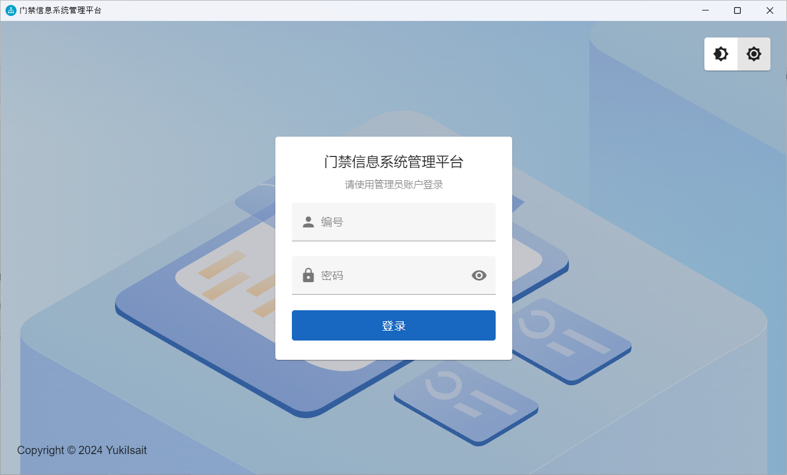
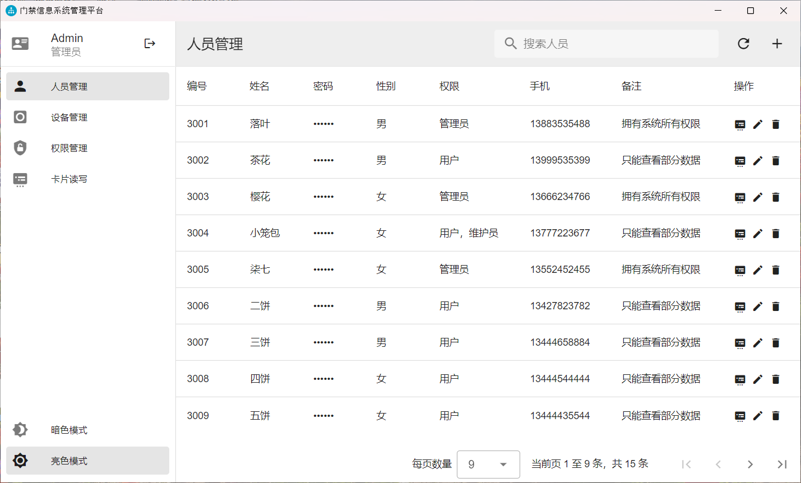
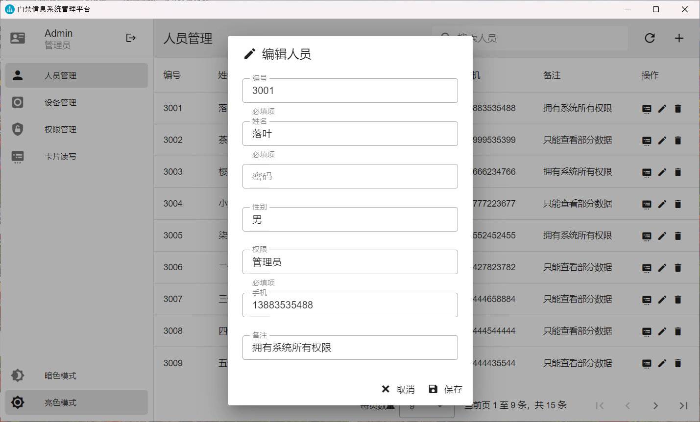
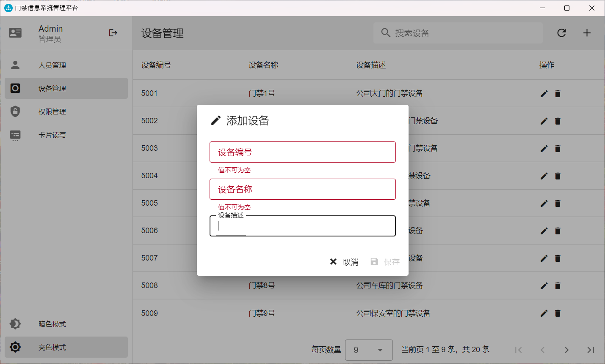
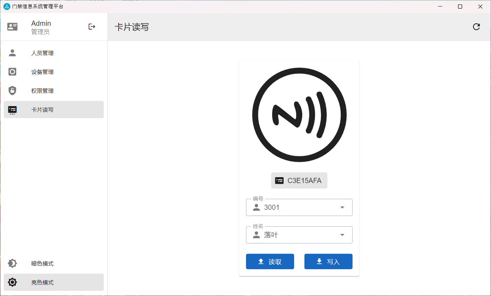
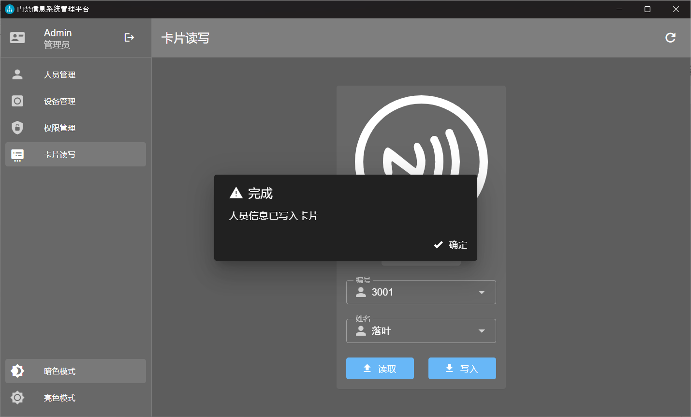
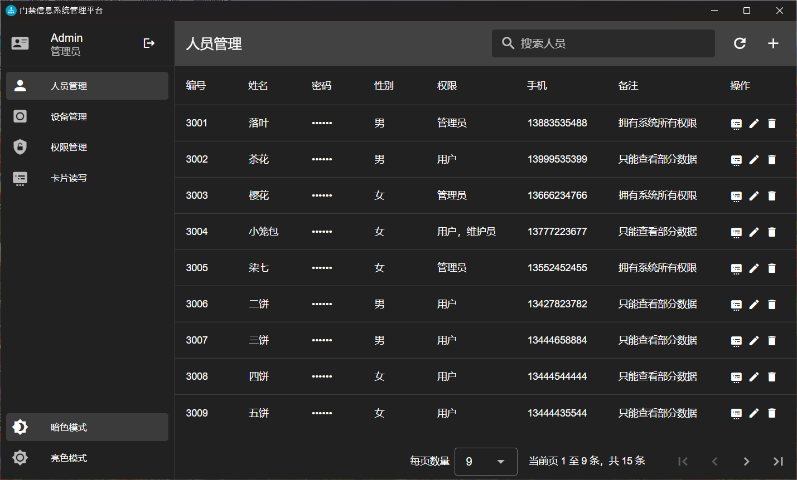

# Identity Authentication Access Control System Based on NFC Technology - Management Platform

🌍 *[简体中文](README.md) ∙ [English](README-EN.md)*

An identity authentication access control system based on NFC technology. Leveraging the portability and intelligence of mobile terminal devices, the system achieves rapid and secure identity verification through NFC technology. This repository is part of the implementation of the desktop management platform.

## Main Technologies

- TypeScript
- Electron
- Vue.js (Vue Router, Vuex)
- Vuetify

## Running the Project

> Note: This repository is for the front-end part of the project, which needs to be used in conjunction with the server.

- Install dependencies:

    ```bash
    npm install
    ```

- Run the project:

    ```bash
    npm run dev
    ```

- Build the project:

    ```bash
    npm run build
    ```

## Project Preview

1. Login Page

    

2. Personnel Management Page

    

3. Personnel Management Page - Edit Personnel

    

4. Device Management Page

    

5. Device Management Page - Add Device

    

6. Permission Management Page

    

7. Card Read/Write Page

    

8. Card Read/Write Page - Write Completed (Dark Mode)

    

9. Personnel Management Page (Dark Mode)

    

## License

This project is licensed under the MIT License. See the [LICENSE](LICENSE.md) file for details.
