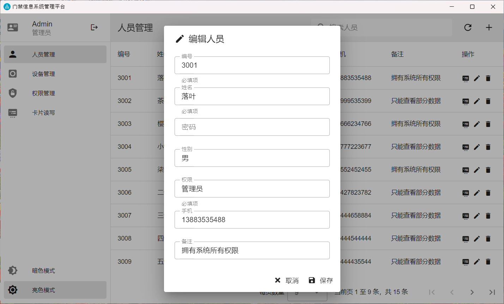
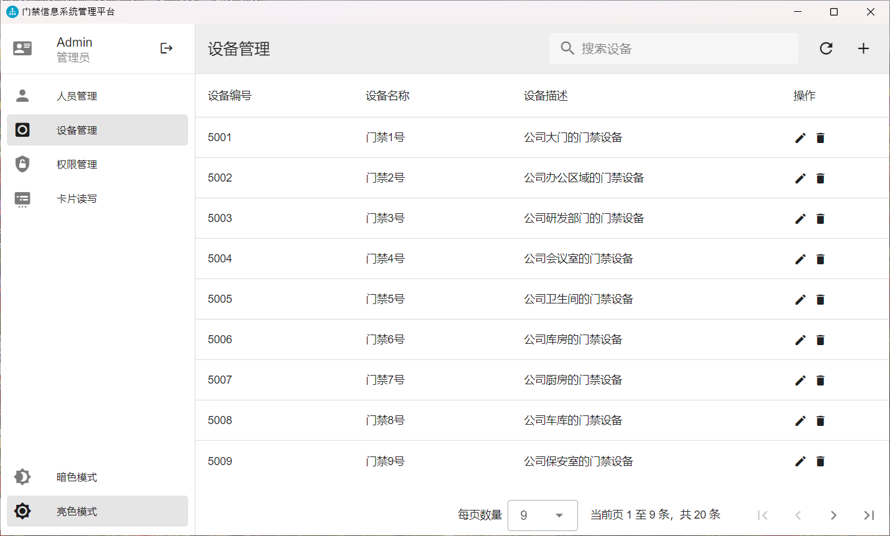
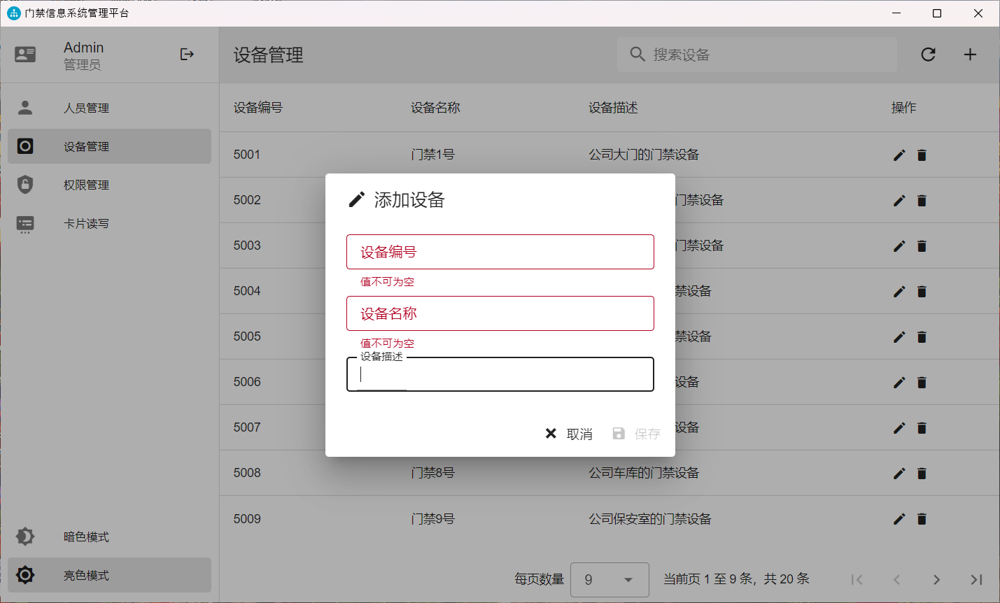
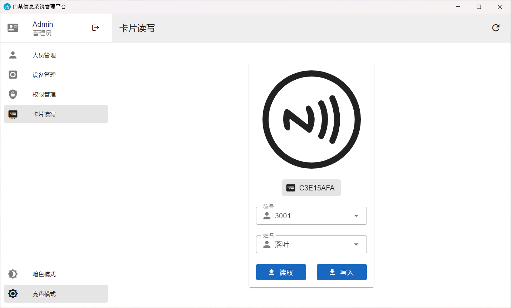
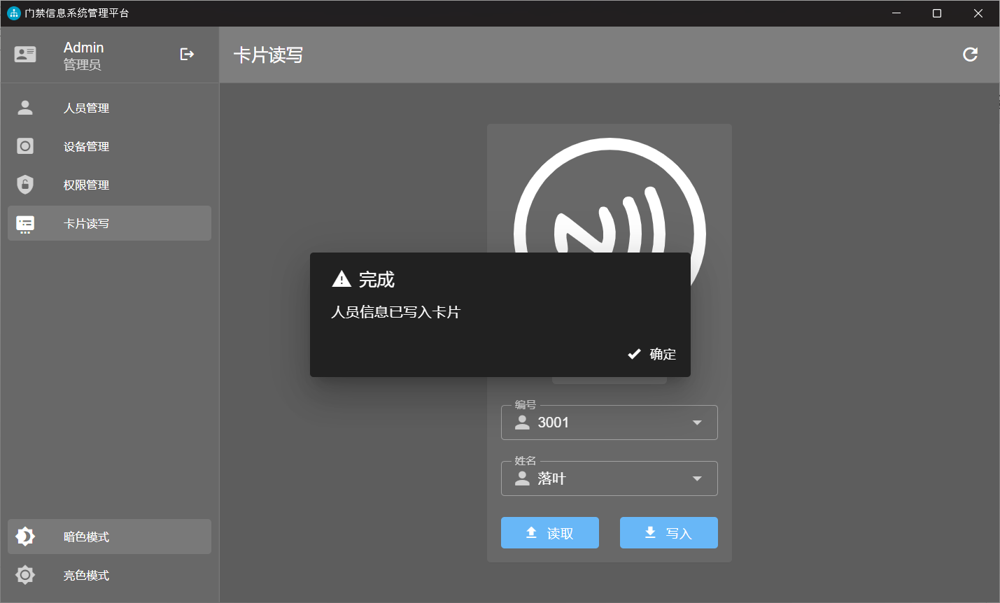

# 基于NFC技术的身份验证门禁系统 - 管理平台

🌍 *[English](README-EN.md) ∙ [简体中文](README.md)*

一种基于NFC技术的身份验证门禁系统，利用移动终端设备的便携性和智能化特点，通过NFC技术实现快速、安全的身份验证，并通过物联网技术管理身份信息，提高安全性和灵活性。本仓库为桌面端管理平台的实现部分。

## 主要技术

- TypeScript
- Electron
- Vue.js (Vue Router, Vuex)
- Vuetify

## 运行项目

> 注意：本仓库为项目的前端部分，需要配合服务端使用。

- 安装依赖：

    ```bash
    npm install
    ```

- 运行项目：

    ```bash
    npm run dev
    ```

- 打包项目：

    ```bash
    npm run build
    ```

## 项目预览

1. 登录页面

    

2. 人员管理页面

    

3. 人员管理页面 - 编辑人员

    

4. 设备管理页面

    

5. 设备管理页面 - 添加设备

    

6. 权限管理页面

    

7. 卡片读写页面

    

8. 卡片读写页面 - 写入完成（暗色模式）

    

9. 人员管理页面（暗色模式）

    

## 开源许可

本项目开源于MIT许可证，详见[LICENSE](LICENSE.md)文件。
